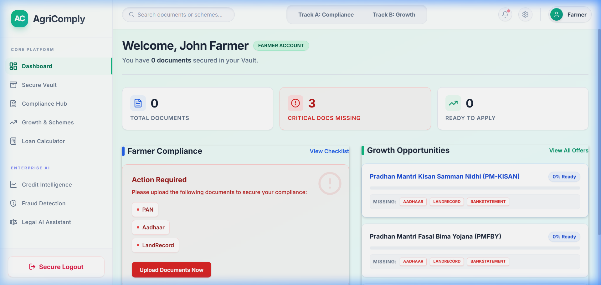
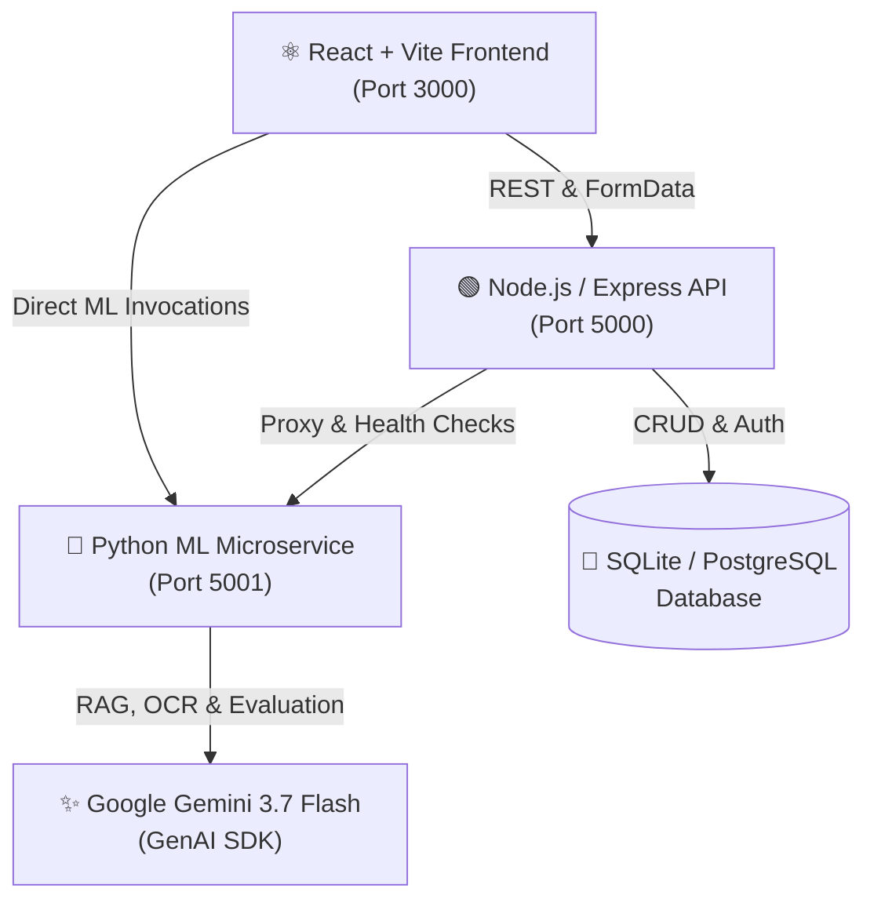

<div align="center">

# 🌾 AgriComply AI
### *Enterprise Dual-Track Agricultural Legal Compliance & Alternative Credit Intelligence*

[](https://react.dev/)
[](https://nodejs.org/)
[](https://flask.palletsprojects.com/)
[](https://ai.google.dev/)
[](https://tailwindcss.com/)
[](https://opensource.org/licenses/MIT)

<br/>

**AgriComply AI** is an intelligent, unified platform designed to help farmers, Farmer Producer Organizations (FPOs), and agri-MSMEs navigate complex legal compliance, secure bank credit through alternative ML scoring, and discover government subsidies using state-of-the-art multimodal AI.

<br/>



</div>

---

## 📑 Table of Contents
- [🌟 Key Features & Visual Walkthrough](#-key-features--visual-walkthrough)
  - [1. Split-Screen Authentication & Role Onboarding](#1-split-screen-authentication--role-onboarding)
  - [2. Dual-Track Farmer & FPO Dashboard](#2-dual-track-farmer--fpo-dashboard)
  - [3. Secure Document Vault](#3-secure-document-vault)
  - [4. AI Legal Compliance Hub & Gap Analysis](#4-ai-legal-compliance-hub--gap-analysis)
  - [5. Intelligent Pre-Flight Compliance Bundler & KYC Radar](#5-intelligent-pre-flight-compliance-bundler--kyc-radar)
  - [6. Alternative Credit Scoring (AgriScore & SHAP)](#6-alternative-credit-scoring-agriscore--shap)
  - [7. Senior Credit Officer AI Loan Eligibility](#7-senior-credit-officer-ai-loan-eligibility)
  - [8. Government Scheme & Bank Credit Discovery](#8-government-scheme--bank-credit-discovery)
  - [9. Agentic Legal AI Assistant (Vector RAG)](#9-agentic-legal-ai-assistant-vector-rag)
  - [10. Error Level Analysis (ELA) Forgery Detection](#10-error-level-analysis-ela-forgery-detection)
- [🏗️ System Architecture](#️-system-architecture)
- [⚡ Quick Start (1-Click Run)](#-quick-start-1-click-run)
- [🌐 Service Ports & URLs](#-service-ports--urls)
- [🔑 Demo Credentials](#-demo-credentials)
- [🛠️ Tech Stack](#️-tech-stack)
- [🧪 End-to-End Automated Test Suite](#-end-to-end-automated-test-suite)
- [🚀 Cloud Deployment](#-cloud-deployment)

---

## 🌟 Key Features & Visual Walkthrough

### 1. Split-Screen Authentication & Role Onboarding
* Glassmorphic split-screen interface with instant demo login shortcuts.
* Supports **Individual Farmers**, **Farmer Producer Organizations (FPOs)**, and **Agri-MSMEs** with tailored legal checklists.

<div align="center">
  
  <br/><br/>
  
</div>

---

### 2. Dual-Track Farmer & FPO Dashboard
* Live summary of document compliance health, missing mandatory filings, and immediate financial growth opportunities.
* Actionable alert banners with 1-click document upload triggers.

<div align="center">
  
</div>

---

### 3. Secure Document Vault
* Centralized encrypted repository for Aadhaar, PAN, 7/12 Land Records, and Bank Statements.
* Instant automated AI document classification, SHA-256 cryptographic sealing, and document lifecycle controls (Upload, View, Replace, Delete).

<div align="center">
  
</div>

---

### 4. AI Legal Compliance Hub & Gap Analysis
* Analyzes uploaded documents against regional agricultural compliance laws and statutory deadlines.
* Role-specific tracking (Farmer Land Titling / FPO Annual MCA Filings / MSME GST Filings) with estimated non-compliance penalty calculations.

<div align="center">
  
</div>

---

### 5. Intelligent Pre-Flight Compliance Bundler & KYC Radar
* **Live Identity Verification**: Extracts KYC entities across documents and executes Levenshtein fuzzy string matching.
* **Generative Portal Optimizer**: Applies adaptive thresholding and morphological filters to remove shadows and enforce government portal file-size limits.
* **Zero-Trust Crypto Vault**: Computes client-side and server-side SHA-256 cryptographic seals.

<div align="center">
  
</div>

---

### 6. Alternative Credit Scoring (AgriScore & SHAP)
* Generates an alternative financial credit score (**300–900**) for farmers without traditional CIBIL scores.
* Uses proxy variables (land acreage, annual turnover, seniority, debt burden) with an **XGBoost regressor (94.5% $R^2$ accuracy)** and visual SHAP-style breakdown.

<div align="center">
  
</div>

---

### 7. Senior Credit Officer AI Loan Eligibility
* Multimodal evaluation of loan applications against bank credit policies and actual vault records.
* Powered by **Google Gemini 3.7 Flash** to deliver verified approval odds, financial reasoning, and actionable checklists.

<div align="center">
  
</div>

---

### 8. Government Scheme & Bank Credit Discovery
* Matches user profiles against active government subsidies (**PM-KISAN**, **PMFBY**, **SMAM**) and bank credit products (**KCC**, **Tractor Loans**).
* Real-time document readiness match percentages and missing prerequisite badges.

<div align="center">
  
</div>

---

### 9. Agentic Legal AI Assistant (Vector RAG)
* Conversational AI legal assistant powered by Retrieval-Augmented Generation (RAG) over official agricultural PDFs.
* Formatted UI with styled emerald badges, numbered steps, quick suggestion chips, and one-click answer copying.

<div align="center">
  
</div>

---

### 10. Error Level Analysis (ELA) Forgery Detection
* Detects digital pixel tampering, forged text, and image manipulation in uploaded agricultural documents.
* Calculates pixel compression anomalies and provides an authenticity confidence score.

<div align="center">
  
</div>

---

## 🏗️ System Architecture



---

## ⚡ Quick Start (1-Click Run)

### 🖱️ Windows (1-Click Launch)
1. Open this project folder in File Explorer.
2. **Double-click** on **[`RUN_PROJECT.bat`](RUN_PROJECT.bat)**.
3. All 3 services launch in parallel and automatically open **`http://localhost:3000`** in your browser in 2 seconds.
4. When finished, double-click **[`STOP_PROJECT.bat`](STOP_PROJECT.bat)** to cleanly shut down all services.

### 💻 Command Line (Windows)
```powershell
.\RUN_PROJECT.bat
```

### 🍎 macOS / Linux
```bash
chmod +x start-local.sh
./start-local.sh
```

---

## 🌐 Service Ports & URLs

| Service | Port | URL | Role / Function |
|---|---|---|---|
| **Frontend Web App** | `3000` | **[http://localhost:3000](http://localhost:3000)** | React 18 UI with Glassmorphism & Micro-animations |
| **Backend REST API** | `5000` | **[http://localhost:5000](http://localhost:5000)** | Express.js API, JWT Auth & Database Layer |
| **Python ML Microservice** | `5001` | **[http://localhost:5001](http://localhost:5001)** | Flask ML microservice (Gemini 3.7 + Scorer) |

---

## 🔑 Demo Credentials

| Role | Email | Password | Pre-configured Features |
|---|---|---|---|
| **Individual Farmer** | `farmer@demo.com` | `demo123` | PM-KISAN, Land Record Tracking, KCC Loans |
| **FPO / Cooperative** | `fpo@demo.com` | `demo123` | MCA Compliance, Audit Bundler, Machinery Subsidies |
| **Agri-Business (MSME)** | `msme@demo.com` | `demo123` | GST Compliance, Working Capital Loans, ELA Scanner |

*(Or register a new account on the Register page).*

---

## 🛠️ Tech Stack

* **Frontend:** React 18, Vite, Tailwind CSS, Framer Motion, Lucide React, Recharts
* **Backend:** Node.js, Express.js, Better-SQLite3 / PostgreSQL, Multer, JWT, Cryptography
* **ML Microservice:** Python 3.13, Flask, Flask-CORS, Flask-SQLAlchemy, NumPy, Pillow, PyPDF
* **AI & Security:** Google Gemini 3.7 Flash API, Vector Cosine Search, Error Level Analysis (ELA), SHA-256 Crypto Hashing, Keystroke Dynamics

---

## 🧪 End-to-End Automated Test Suite

An automated test suite validates all 20 functions across the entire stack:

```powershell
$NODE_EXE = "C:\Users\srijan\AppData\Local\nodejs\node-v22.17.0-win-x64\node.exe"
$env:NODE_PATH = "$PWD\server\node_modules"
& $NODE_EXE scratch\comprehensive_test.js
```

**Results: 20 / 20 Tests Passed (100%)**

---

## 🚀 Cloud Deployment

### Backend (Render Blueprint)
1. Connect this repo to [Render Dashboard](https://render.com/dashboard) -> **New Blueprint**.
2. Set `GOOGLE_API_KEY` and `GEMINI_API_KEY`.
3. Render automatically spins up the database, Node.js server, and Python ML service via `render.yaml`.

### Frontend (Vercel)
1. Import repository on [Vercel](https://vercel.com/new) with Root Directory set to `client`.
2. Configure environment variables:
   * `VITE_API_URL` = `https://agricomply-server.onrender.com`
   * `VITE_ML_URL` = `https://agricomply-ml.onrender.com`
3. Deploy!

---

## 📄 License
This project is open source and available under the [MIT License](LICENSE).
