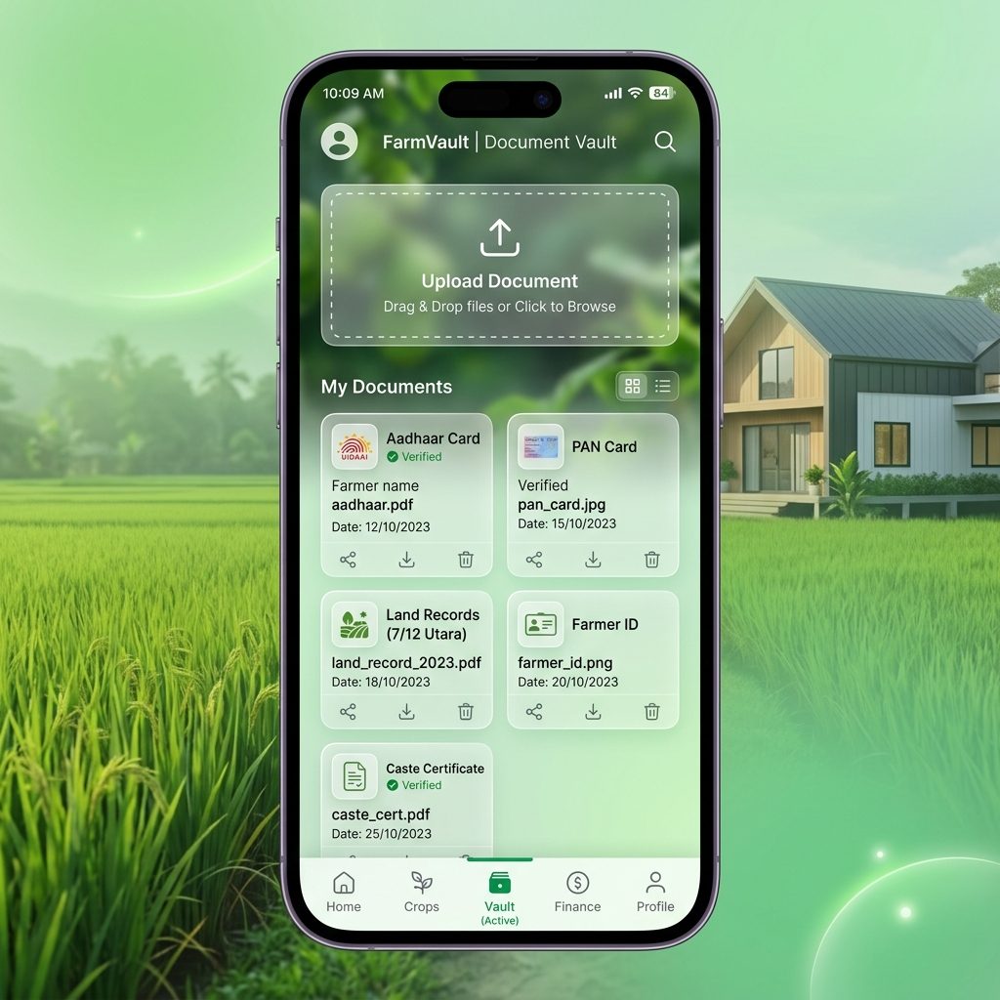
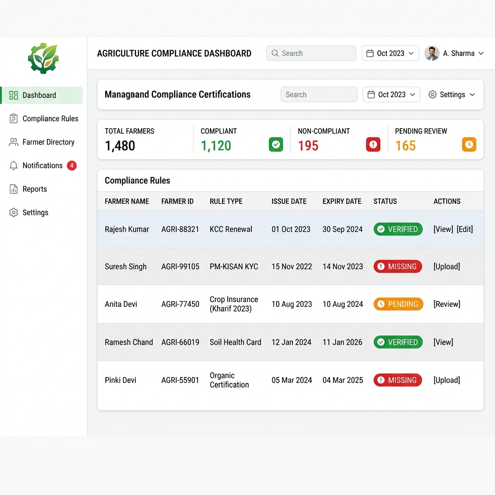
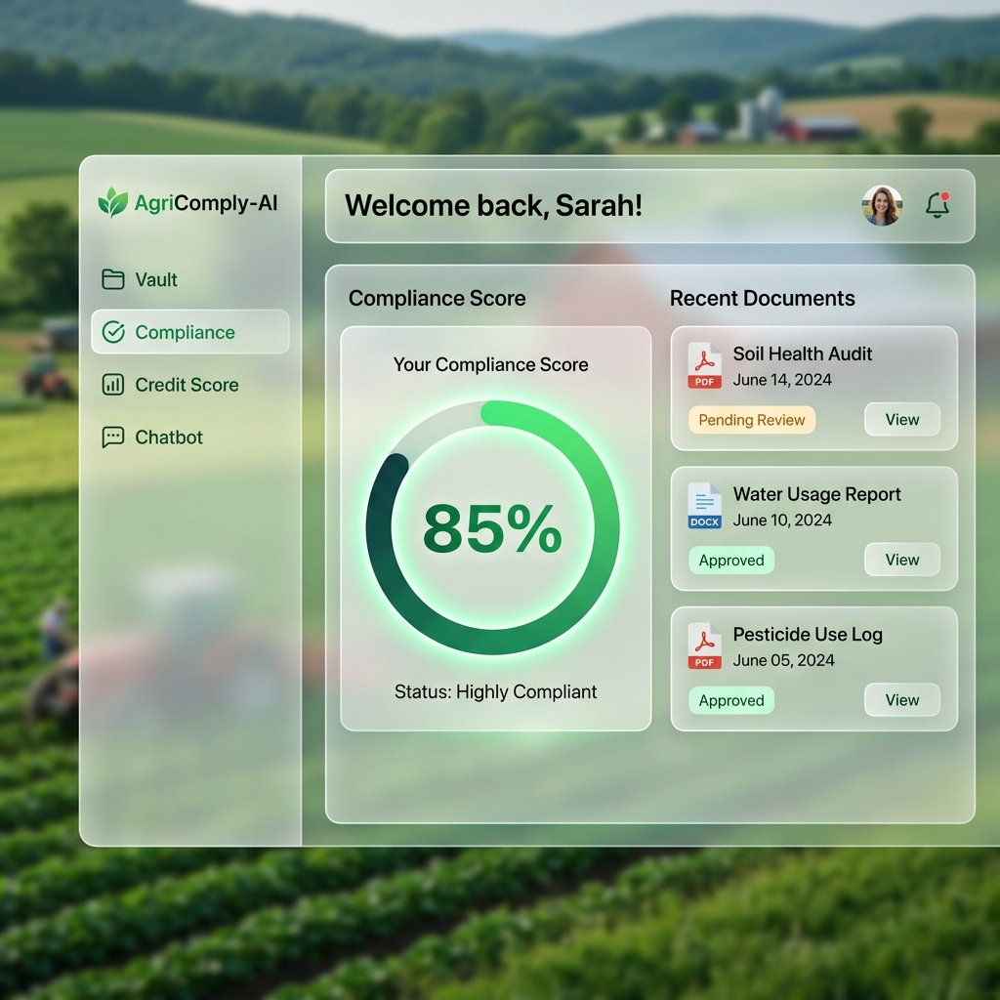
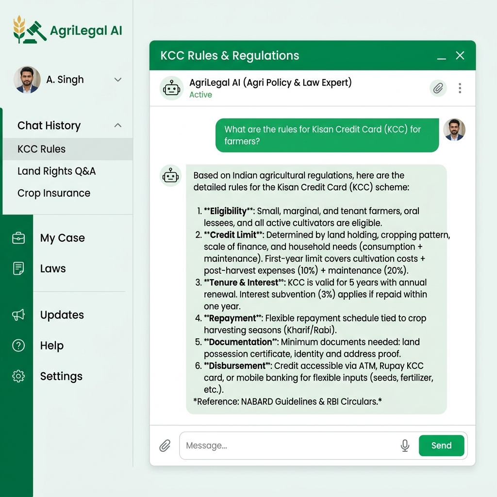

# AgriComply AI 🌾🤖

AgriComply AI is an intelligent, unified platform designed to help farmers and agricultural businesses navigate complex legal compliance, secure loans through alternative credit scoring, and discover government subsidies using state-of-the-art AI.

## 🌟 Key Features

### 1. 📂 Secure Document Vault
- Centralized storage for all agricultural documents (Aadhaar, PAN, Land Records, Bank Statements).
- Automated document classification using AI.

### 2. ⚖️ AI Legal Compliance Dashboard
- Analyzes uploaded documents against regional agricultural compliance laws.
- Identifies missing documentation for compliance and estimates potential penalties.
- Intelligent cross-document consistency checks to ensure data matches across all records.

### 3. 📈 Alternative Credit Scoring
- Calculates an alternative credit score for marginalized farmers who lack traditional credit histories.
- Uses proxy data (land size, crop yield estimates, informal transaction records) to generate a reliable financial trust score for micro-lending.

### 4. 🏛️ Government Scheme Discovery
- Matches a farmer's unique profile against a database of active government subsidies and schemes.
- Instantly checks eligibility based on their document vault.

### 5. 💬 Legal RAG Chatbot
- Ask complex agricultural law questions in natural language.
- Powered by a custom Retrieval-Augmented Generation (RAG) engine over legal texts.

### 6. 🕵️ ELA Forgery Detection
- Secures the platform against document fraud using Error Level Analysis (ELA).
- Detects tampered pixels, copy-paste artifacts, and digital manipulation in uploaded records.

---

## 🛠️ Technology Stack

- **Frontend:** React, Vite, Tailwind CSS (Glassmorphism & Modern UI)
- **Backend:** Node.js, Express.js
- **Database:** PostgreSQL (Migrated from SQLite for persistent cloud storage)
- **ML/AI Service:** Python, Flask, Google Gemini API
- **AI Techniques:** Cosine Similarity Vector Search, Error Level Analysis, Neuro-Symbolic Logic

---

## 🚀 Deployment

The project is fully configured for cloud deployment using **Vercel** (Frontend) and **Render** (Backend & Database).

### 1. Deploying the Backend (Render)
The repository contains a `render.yaml` Blueprint which automatically provisions:
- A PostgreSQL Database
- The Node.js Server (`agricomply-server`)
- The Python ML Service (`agricomply-ml`)

**Steps:**
1. Go to [Render Dashboard](https://render.com/dashboard) -> New -> Blueprint.
2. Connect this GitHub repository.
3. Provide your `GOOGLE_API_KEY` and `GEMINI_API_KEY` when prompted.
4. Render will automatically build and link all three services.

### 2. Deploying the Frontend (Vercel)
1. Go to [Vercel](https://vercel.com/new) and import the repository.
2. Set the Root Directory to `client`.
3. Add the following Environment Variables (matching your Render URLs):
   - `VITE_API_URL` = `https://agricomply-server.onrender.com` (or your specific Render URL)
   - `VITE_ML_URL` = `https://agricomply-ml.onrender.com` (or your specific Render URL)
4. Deploy!

---

## 💻 Local Development

To run the project locally, you will need Node.js and Python installed.

1. Clone the repository.
2. Create `.env` files in `server/` and `ml_service/` with your API keys.
3. Run the setup script:
   - **Windows:** Double-click `start-demo.bat`
   - **Linux/Mac:** Run `chmod +x start.sh && ./start.sh` (if available)

The script will install all necessary npm and pip dependencies and start all three servers concurrently.
