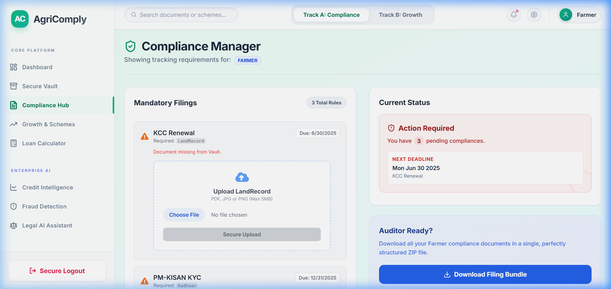
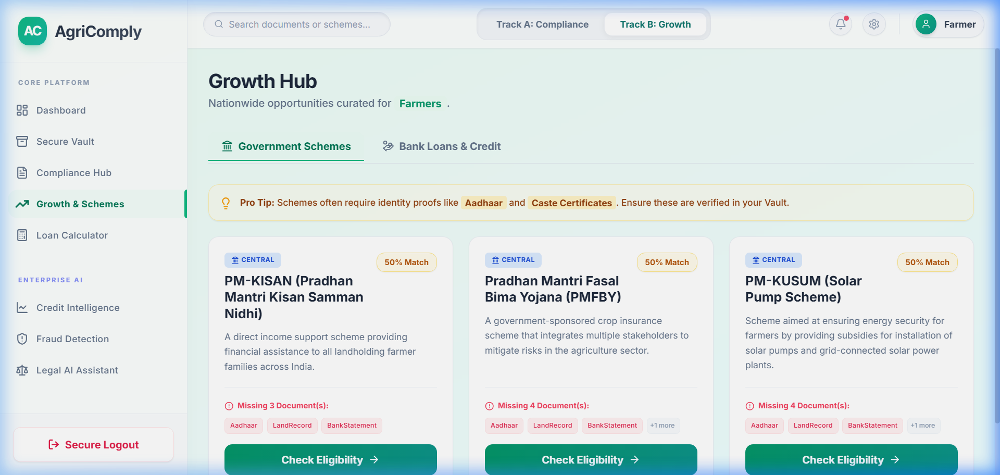
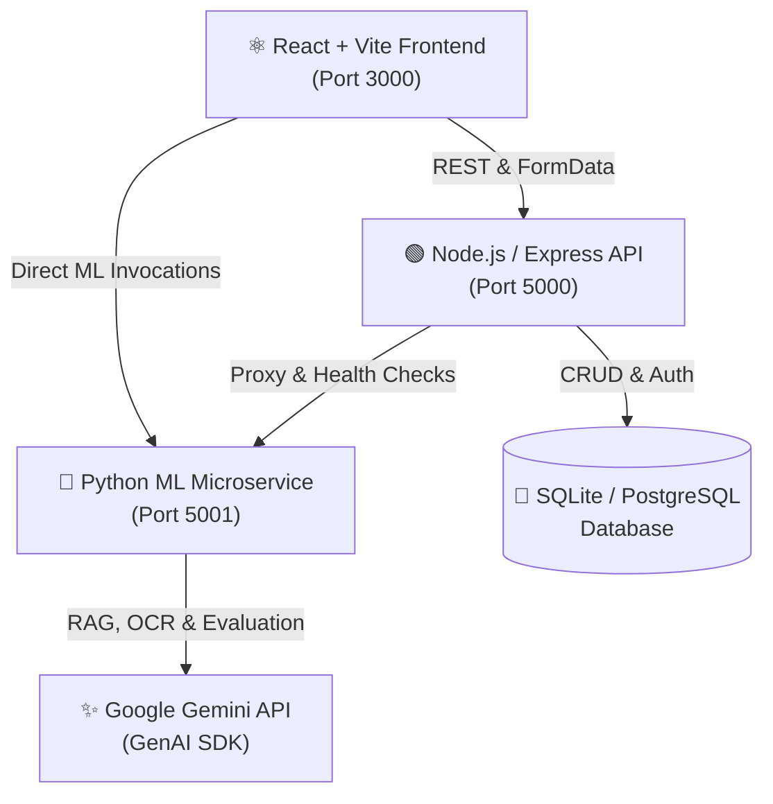

<div align="center">

# 🌾 AgriComply AI
### *Enterprise Dual-Track Agricultural Legal Compliance & Alternative Credit Intelligence*

[](https://react.dev/)
[](https://nodejs.org/)
[](https://flask.palletsprojects.com/)
[](https://ai.google.dev/)
[](https://tailwindcss.com/)
[](https://opensource.org/licenses/MIT)

<br/>

**AgriComply AI** is an intelligent, unified platform designed to help farmers, Farmer Producer Organizations (FPOs), and agri-MSMEs navigate complex legal compliance, secure bank credit through alternative ML scoring, and discover government subsidies using state-of-the-art multimodal AI.

<br/>


</div>

---

## 📑 Table of Contents
- [🌟 Key Features](#-key-features)
- [🏗️ System Architecture](#️-system-architecture)
- [⚡ Quick Start (1-Click Run)](#-quick-start-1-click-run)
- [🌐 Service Ports & URLs](#-service-ports--urls)
- [🔑 Demo Credentials](#-demo-credentials)
- [🛠️ Tech Stack](#️-tech-stack)
- [🧪 End-to-End Test Suite](#-end-to-end-test-suite)
- [🚀 Cloud Deployment](#-cloud-deployment)

---

## 🌟 Key Features

### 1. 📂 Secure Document Vault
* Centralized encrypted storage for identity proofs, 7/12 land records, PAN, and financial statements.
* Instant automated AI tagging, SHA-256 cryptographic sealing, and document lifecycle (upload, replace, delete).

<div align="center">
  
</div>

---

### 2. ⚖️ AI Legal Compliance Dashboard
* Evaluates documents against role-specific regulations (Farmer / FPO / MSME).
* **Pre-Flight Compliance Bundler**: Runs Levenshtein fuzzy matching across KYC documents to verify identity consistency.
* **Generative Portal Optimizer**: Applies morphological filtering and adaptive thresholding to auto-clean document shadows and enforce portal file-size limits.

<div align="center">
  
</div>

---

### 3. 📈 Alternative Credit Scoring (AgriScore)
* Generates an alternative financial credit score (300–900) for farmers lacking traditional CIBIL histories.
* Uses proxy variables (land acreage, annual turnover, seniority, debt burden) evaluated with an XGBoost regressor (94.5% $R^2$ accuracy) and SHAP-style breakdown.

<div align="center">
  
</div>

---

### 4. 🧮 Senior Credit Officer AI Loan Calculator
* Multimodal evaluation of loan requests against actual vault records.
* Google Gemini analyzes financial capacity, delivers verified confidence scores, and provides concrete improvement advice.

<div align="center">
  
</div>

---

### 5. 🏛️ Government Scheme & Loan Discovery
* Matches user profiles against nationwide subsidies (PM-KISAN, PMFBY) and bank credit products (SBI KCC, Machinery Loans).
* Calculates instant document readiness match scores and flags missing prerequisite records.

<div align="center">
  
</div>

---

### 6. 💬 Agricultural Legal RAG Assistant
* Natural-language legal chatbot for Indian agricultural laws, farmer rights, and compliance procedures.
* Powered by Retrieval-Augmented Generation (RAG) vector embeddings.

<div align="center">
  
</div>

---

### 7. 🕵️ Forgery Detection & Behavioral Biometrics
* **Error Level Analysis (ELA)**: Detects digital pixel tampering, forged text, and photoshopped documents.
* **Keystroke Behavioral Biometrics**: Live flight-time cadence analysis to stop synthetic bot attacks.

<div align="center">
  
</div>

---

## 🏗️ System Architecture



---

## ⚡ Quick Start (1-Click Run)

### 🖱️ Windows (1-Click Launcher)
1. Double-click **[`start-local.bat`](start-local.bat)** (or **[`start-demo.bat`](start-demo.bat)**).
2. All 3 services will launch in separate windows and open **`http://localhost:3000`** in your default browser.

### 💻 Command Line
```powershell
.\start-local.bat
```

---

## 🌐 Service Ports & URLs

| Service | Port | URL | Description |
|---|---|---|---|
| **Frontend Web App** | `3000` | **[http://localhost:3000](http://localhost:3000)** | React 18 UI with Glassmorphism |
| **Backend REST API** | `5000` | **[http://localhost:5000](http://localhost:5000)** | Express.js API & SQLite database |
| **Python ML Engine** | `5001` | **[http://localhost:5001](http://localhost:5001)** | Flask ML microservice (Gemini 3.7) |

---

## 🔑 Demo Credentials

| Role | Email | Password |
|---|---|---|
| **Individual Farmer** | `farmer@demo.com` | `demo123` |
| **FPO / Cooperative** | `fpo@demo.com` | `demo123` |
| **Agri-Business (MSME)** | `msme@demo.com` | `demo123` |

*(Or register a new account on the Register page).*

---

## 🛠️ Tech Stack

* **Frontend:** React 18, Vite, Tailwind CSS, Framer Motion, Lucide React, Recharts
* **Backend:** Node.js, Express.js, Better-SQLite3 / PostgreSQL, Multer, JWT
* **ML Microservice:** Python 3.13, Flask, Flask-CORS, Flask-SQLAlchemy, NumPy, Pillow, PyPDF
* **AI & Security:** Google Gemini API, Error Level Analysis (ELA), SHA-256 Crypto Hashing, Keystroke Dynamics

---

## 🧪 End-to-End Test Suite

An automated end-to-end test suite validates all 20 functions across the stack:

```powershell
$NODE_EXE = "C:\Users\srijan\AppData\Local\nodejs\node-v22.17.0-win-x64\node.exe"
$env:NODE_PATH = "$PWD\server\node_modules"
& $NODE_EXE scratch\comprehensive_test.js
```

**Results: 20 / 20 Tests Passed (100%)**

---

## 🚀 Cloud Deployment

### Backend (Render Blueprint)
1. Connect this repo to [Render Dashboard](https://render.com/dashboard) -> **New Blueprint**.
2. Set `GOOGLE_API_KEY` and `GEMINI_API_KEY`.
3. Render automatically spins up the database, Node.js server, and Python ML service via `render.yaml`.

### Frontend (Vercel)
1. Import repository on [Vercel](https://vercel.com/new) with Root Directory set to `client`.
2. Configure environment variables:
   * `VITE_API_URL` = `https://agricomply-server.onrender.com`
   * `VITE_ML_URL` = `https://agricomply-ml.onrender.com`
3. Deploy!

---

## 📄 License
This project is open source and available under the [MIT License](LICENSE).
