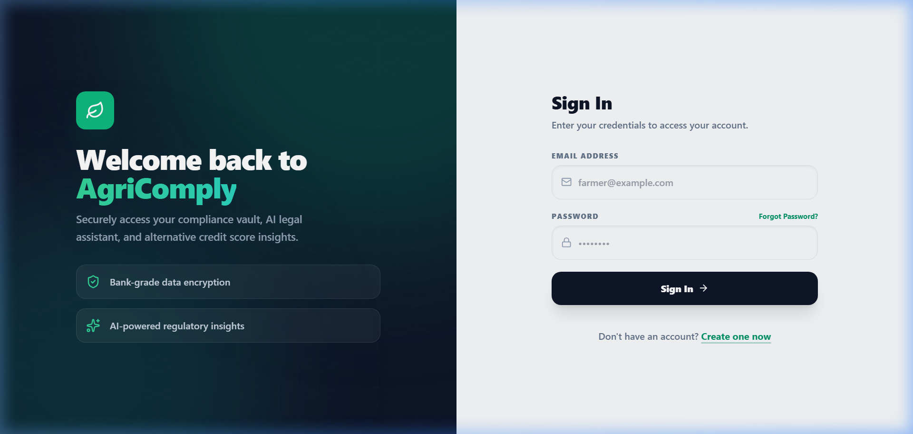
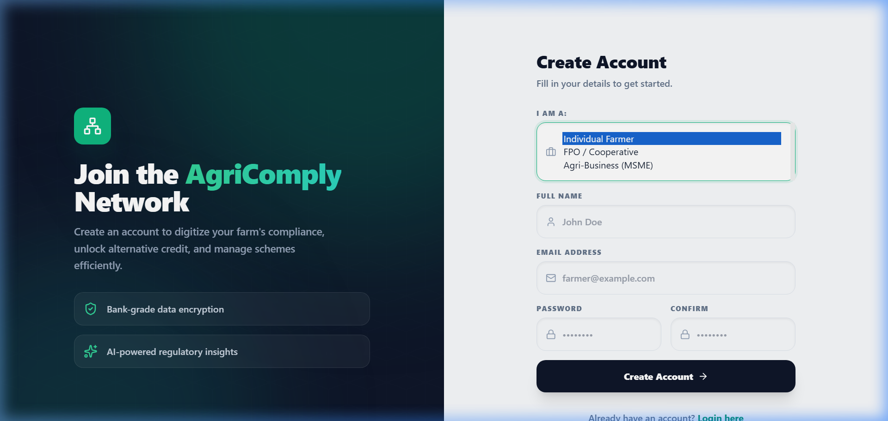
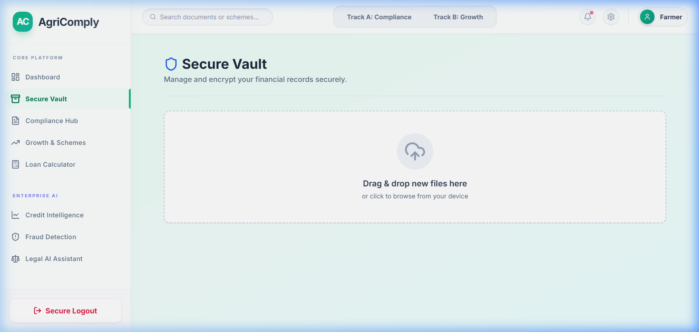
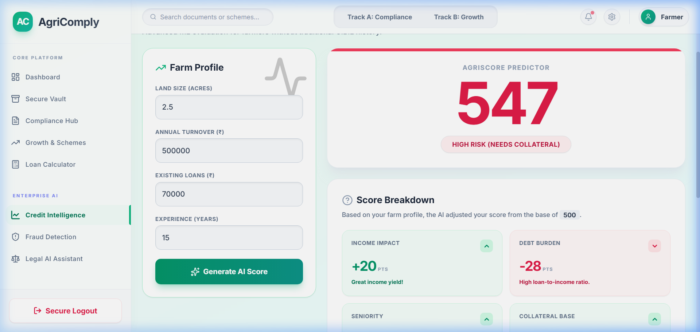
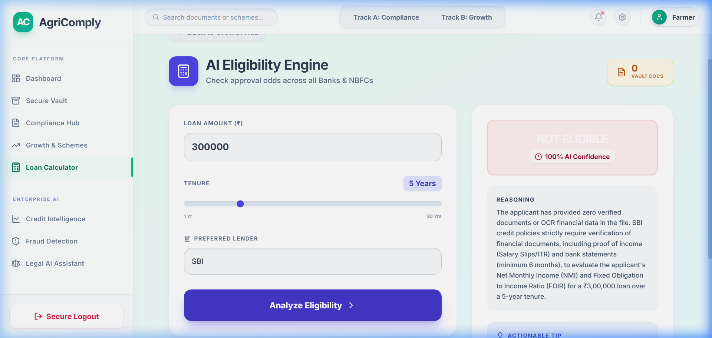
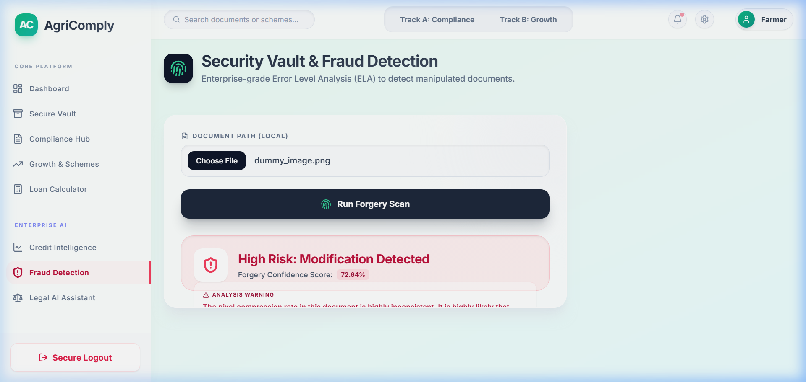
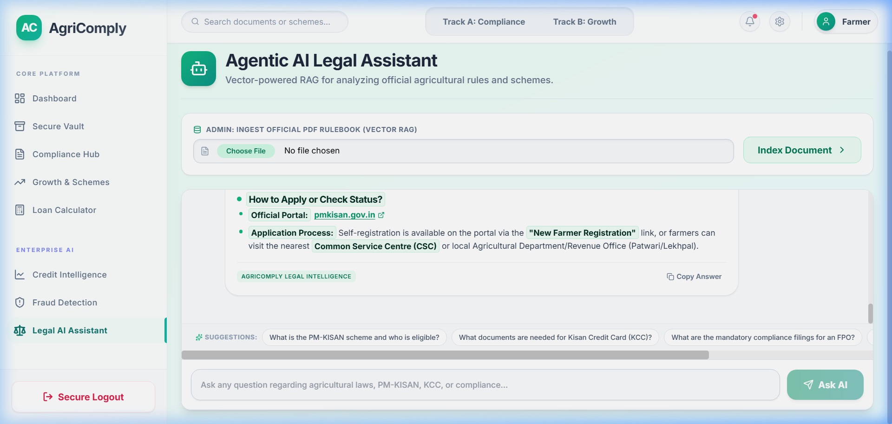
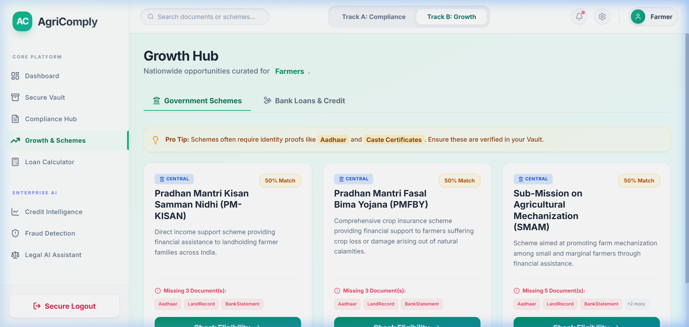
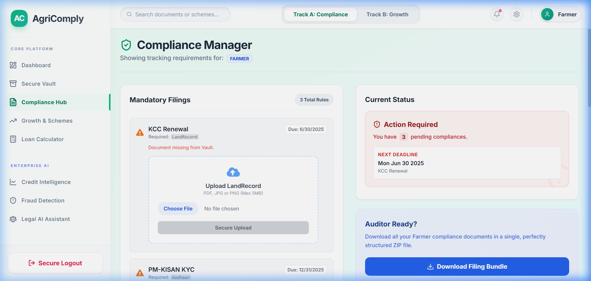
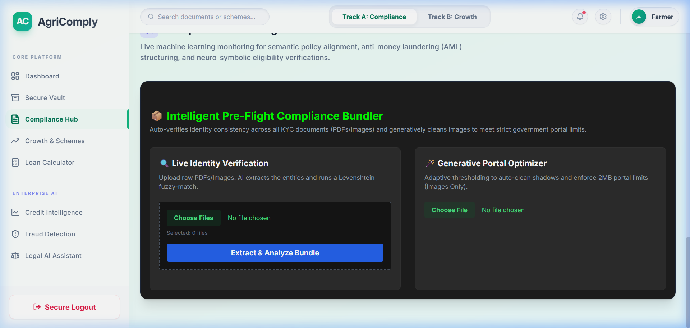

# 🌾 AgriComply AI — Master User & Startup Guide

---

## ⚡ Quick Start (The Easiest Way to Run)

### 🖱️ Option 1: 1-Click Launch (Recommended)
1. Open this project folder in File Explorer:
   ```
   c:\Users\srijan\Desktop\AgriComply-AI-main
   ```
2. **Double-click** on [`start-local.bat`](start-local.bat) (or [`start-demo.bat`](start-demo.bat)).
3. The launcher will automatically start all 3 services in separate windows and open the website in your browser!

### 💻 Option 2: Run from Terminal (PowerShell / CMD)
```powershell
.\start-local.bat
```

---

## 🌐 Application URLs

| Service | Port | Local URL | Role / Function |
|---|---|---|---|
| **Frontend Web App** | `3000` | **[http://localhost:3000](http://localhost:3000)** | React + Vite UI (Glassmorphic Dashboard) |
| **Backend API Server** | `5000` | **[http://localhost:5000](http://localhost:5000)** | Node.js Express REST API & Database |
| **Python ML Engine** | `5001` | **[http://localhost:5001](http://localhost:5001)** | Flask ML Microservice (Gemini AI + Scorer) |

---

## 🔑 Demo Login Credentials

You can sign in with any of the demo accounts or click **Create Account** to register a new one.

| Account Type | Email | Password |
|---|---|---|
| **Farmer Demo** | `farmer@demo.com` | `demo123` |
| **FPO / Cooperative** | `fpo@demo.com` | `demo123` |
| **MSME Agri-Business** | `msme@demo.com` | `demo123` |




*(You can also use any email/password you create on the Register page).*

---

## 🧭 Feature Walkthrough & How to Test Everything

### 1. 📂 Secure Document Vault (`/vault`)
* **What it does:** Secure encrypted document repository for agricultural records.
* **How to test:** 
  1. Click **Secure Vault** on the sidebar.
  2. Drag and drop any file (e.g. `sample_aadhaar.pdf` from the project root) into the upload area.
  3. Notice instant document tagging and storage.
  4. Test the **Replace** and **Delete** buttons on any document card.



### 2. 📈 Credit Intelligence (`/credit-score`)
* **What it does:** Alternative credit scoring algorithm for farmers without traditional CIBIL scores.
* **How to test:**
  1. Click **Credit Intelligence** on the sidebar.
  2. Adjust Land Size (Acres), Annual Turnover (₹), Existing Loans (₹), and Experience (Years).
  3. Click **Generate AI Score**.
  4. View the real-time calculated score (300–900), risk badge, SHAP-style positive/negative score breakdown, actionable improvement tips, and live XGBoost performance metrics (94.5% R² accuracy).



### 3. 🧮 AI Loan Eligibility Calculator (`/loan-check`)
* **What it does:** Evaluates loan requests against bank policies and actual vault documents using Gemini AI.
* **How to test:**
  1. Click **Loan Calculator** on the sidebar.
  2. Enter a loan amount (e.g., `₹5,00,000`), tenure (e.g., `5 years`), and select a bank (`State Bank of India`).
  3. Click **Analyze Eligibility**.
  4. The AI Senior Credit Officer analyzes your vault documents and delivers a verified approval odds percentage, detailed financial reasoning, and actionable recommendations.



### 4. 🛡️ Security Vault & Fraud Detection (`/security`)
* **What it does:** Error Level Analysis (ELA) to detect forged or photoshopped documents.
* **How to test:**
  1. Click **Fraud Detection** on the sidebar.
  2. Upload any image or PDF.
  3. Click **Run Forgery Scan**.
  4. The system calculates pixel compression anomalies and reports whether the document is authentic or tampered with a confidence score.



### 5. 💬 Agricultural Legal AI Assistant (`/legal-bot`)
* **What it does:** RAG (Retrieval-Augmented Generation) chatbot for Indian farming regulations, PM-KISAN, PMFBY, KCC, and land laws.
* **How to test:**
  1. Click **Legal AI Assistant** on the sidebar.
  2. Ask questions like:
     * *"What is the PM-KISAN scheme and who is eligible?"*
     * *"What documents are needed for a Kisan Credit Card (KCC)?"*
     * *"What are the penalty rules for late GST filing by an FPO?"*
  3. Receive instant, legally referenced answers with rich styled badges and suggestion chips.



### 6. 🏛️ Growth & Scheme Discovery (`/growth`)
* **What it does:** Curates nationwide government subsidies and bank loans tailored to your account type (Farmer/FPO/MSME).
* **How to test:**
  1. Click **Growth Hub** on the sidebar.
  2. Switch between **Government Schemes** and **Bank Loans & Credit**.
  3. View readiness scores, missing required document badges, and click **Apply / Check Odds** to evaluate.



### 7. ⚖️ Compliance Hub & AI Pre-Flight Bundler (`/compliance`)
* **What it does:** Role-specific compliance checklist, automated gap analysis, and intelligent pre-flight multi-document bundling.
* **How to test:**
  1. Click **Compliance Hub** on the sidebar.
  2. View mandatory filings, deadlines, and compliance status.
  3. Scroll down to the **Enterprise AI Audit Engine**:
     * **Live Identity Verification:** Upload multiple documents to run Levenshtein fuzzy matching and identity consistency radar chart.
     * **Generative Portal Optimizer:** Upload an image to clean shadows and compress file size for government portal upload limits.
     * **Live Bot Defense:** Type slowly in the keystroke box to see behavioral biometrics monitoring your cadence.
     * **Zero-Trust Crypto Vault:** Upload a document to generate a real-time SHA-256 cryptographic seal.




---

## 🛠️ Automated System Test

To run a complete automated test of all 20 backend, ML, and frontend functions at any time:

```powershell
$NODE_EXE = "C:\Users\srijan\AppData\Local\nodejs\node-v22.17.0-win-x64\node.exe"
$env:NODE_PATH = "$PWD\server\node_modules"
& $NODE_EXE scratch\comprehensive_test.js
```

---

## 🔍 Health & Diagnostic Endpoints

* **Node Server Health:** [http://localhost:5000/health](http://localhost:5000/health)
* **ML Service Health:** [http://localhost:5001/health](http://localhost:5001/health)
* **ML Diagnostics & Gemini Status:** [http://localhost:5001/debug](http://localhost:5001/debug)
* **Node-to-ML Proxy:** [http://localhost:5000/api/ml/health](http://localhost:5000/api/ml/health)
